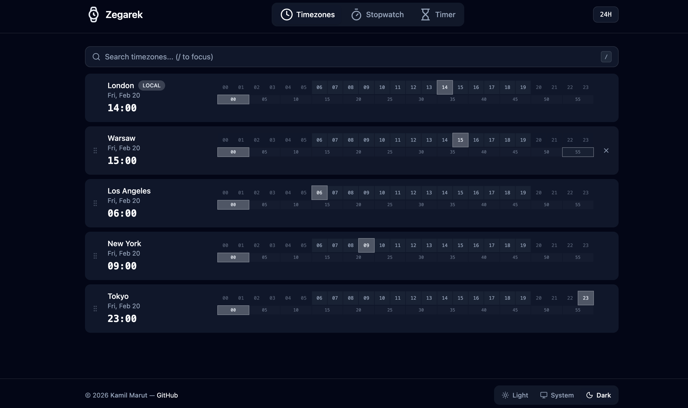

<p align="center">
    <h3 align="center">Zegarek</h3>
    <p align="center">⌚ Web app to compare times in different timezones with additional stopwatch and timer features</p>
</p>



### Features

- Compare times in different timezones
- Stopwatch with lap functionality
- Timer with customizable durations
- Light and dark themes

## Getting Started

### Prerequisites

- Bun >= 1.3.9

### Development server setup

```bash
# Install dependencies
bun install

# Start development server
bun run dev
```

Application will run at `http://localhost:5173`

### Docker setup

Build and run the Docker container:
```bash
# Build and run the Docker image
docker-compose up -d
```

Application will run at `http://localhost:3000`

## License

`Zegarek` is under the terms of the [MIT License](https://www.tldrlegal.com/l/mit), following all clarifications stated in the [license file](LICENSE).
